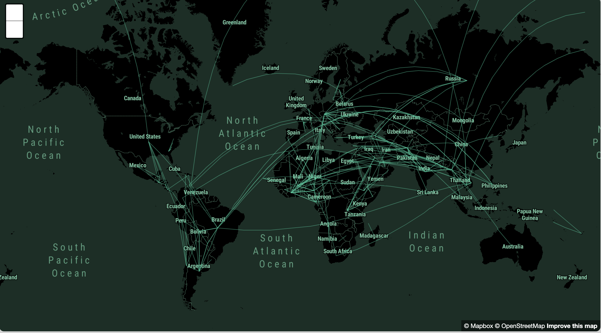
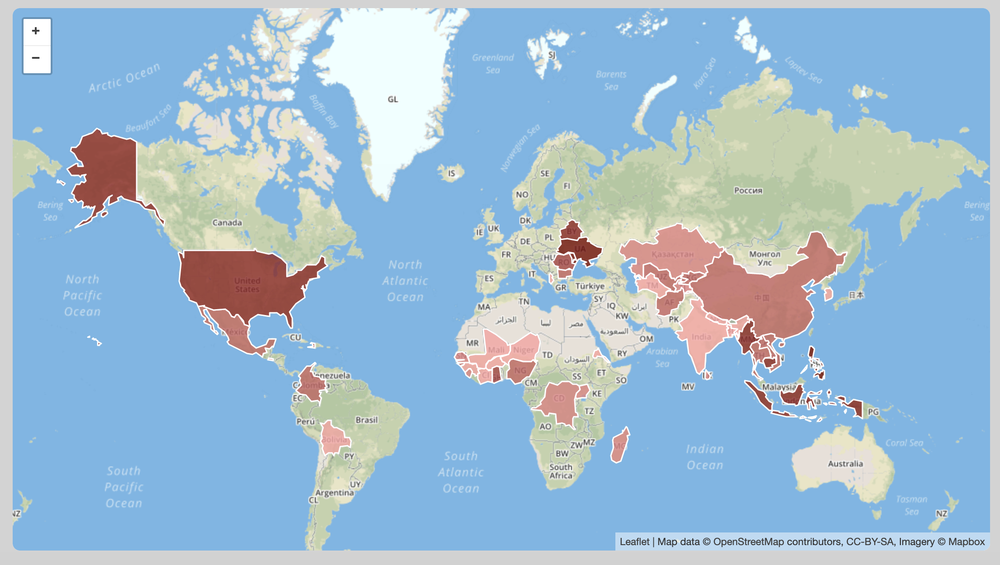
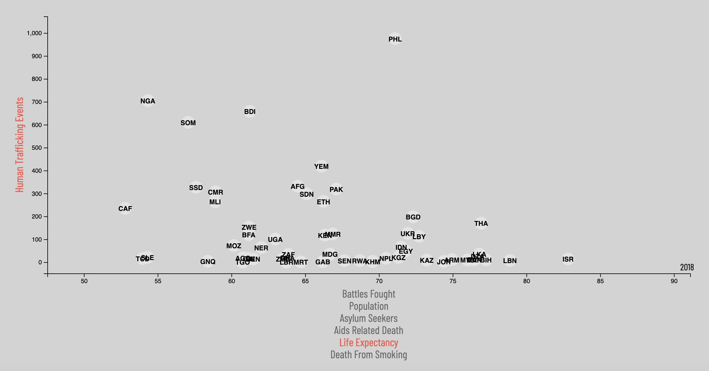
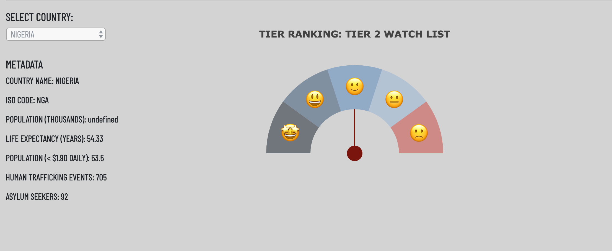
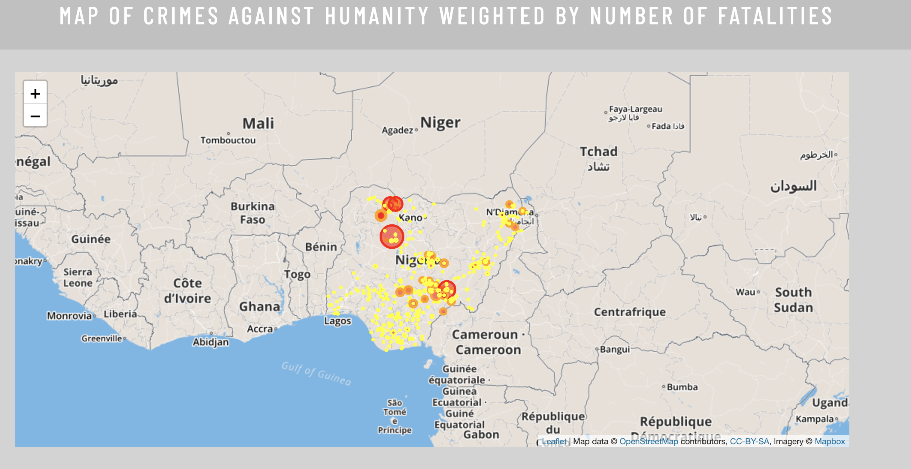
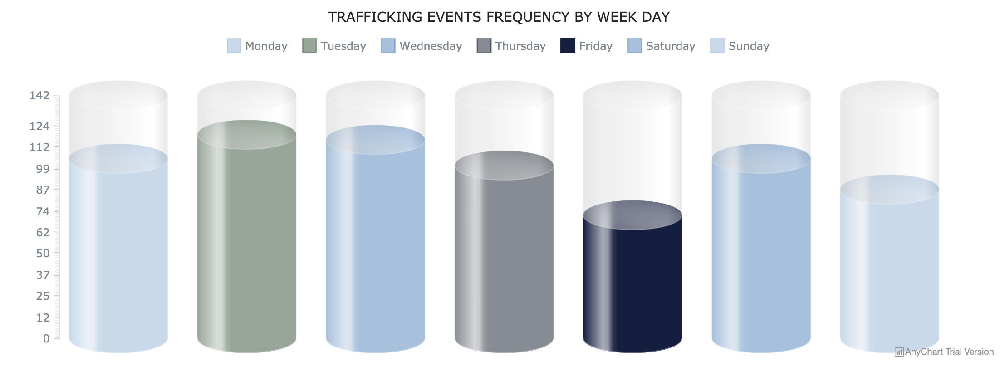
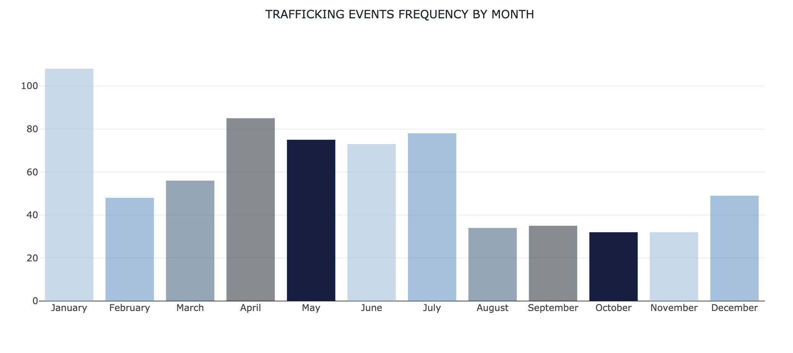
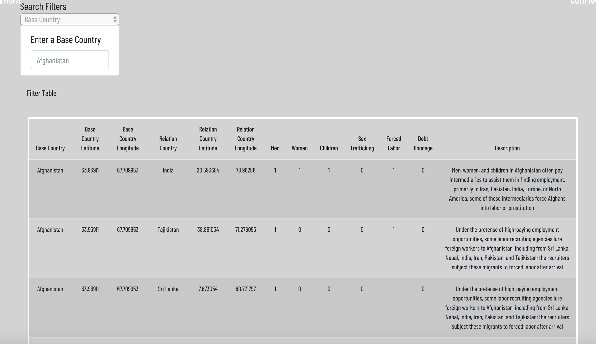

# VISUALIZATION OF HUMAN TRAFFICKING ACROSS THE GLOBE

Built an interactive webpage to explore the nature of human trafficking globally. Some of the key takeaways include:

1. Network map showing human trafficking routes globally;

2. Hot spot maps that show the density of human trafficking events globally with poverty rates as tile layers;

3. Interactive scatter plot of frequency of human trafficking events and country demographics; 

4. Gauge plot showing TIER ranking of each country according to the 2018 TIP report;

5. Word cloud of the most frequent words associated with human trafficking in each country;

6. Bar charts and gauge tanks to show frequency of human trafficking events by days and months;

7. Map of conflicts related to human trafficking events in each country weighted by number of fatalities;

8. Data page to allow users interract with the dataset used to build the charts.

The gauge chart, world cloud, map of conflicts , bar charts and gauge tanks were updated any time that a new country is selected via a dropdown.

- - -

## DATA SOURCES

1. [Counter-trafficking data collaborative](https://www.ctdatacollaborative.org/)

2. [The 2018 Trafficking in Persons (TIP) Report](https://www.state.gov/trafficking-in-persons-report/)

3. [The 2018 Armed Conflict Location & Event Data](www.acleddata.com)

4. [World Bank Poverty Data](http://datatopics.worldbank.org/world-development-indicators/)

- - -

## LIBRARIES USED:

1. D3.js

2. Plotly.js

3. Leaflet.js

4. Anychart.js

5. Mapbox.js

6. Amcharts.js

- - -

##  THE FINAL WEBSITE LOOKED LIKED THIS:

### HOME PAGE

### COUNTRY COMPARISON PAGE

### DATA PAGE

- - -

## Deployment

Deployed the app to GitHub's free static page hosting service.

