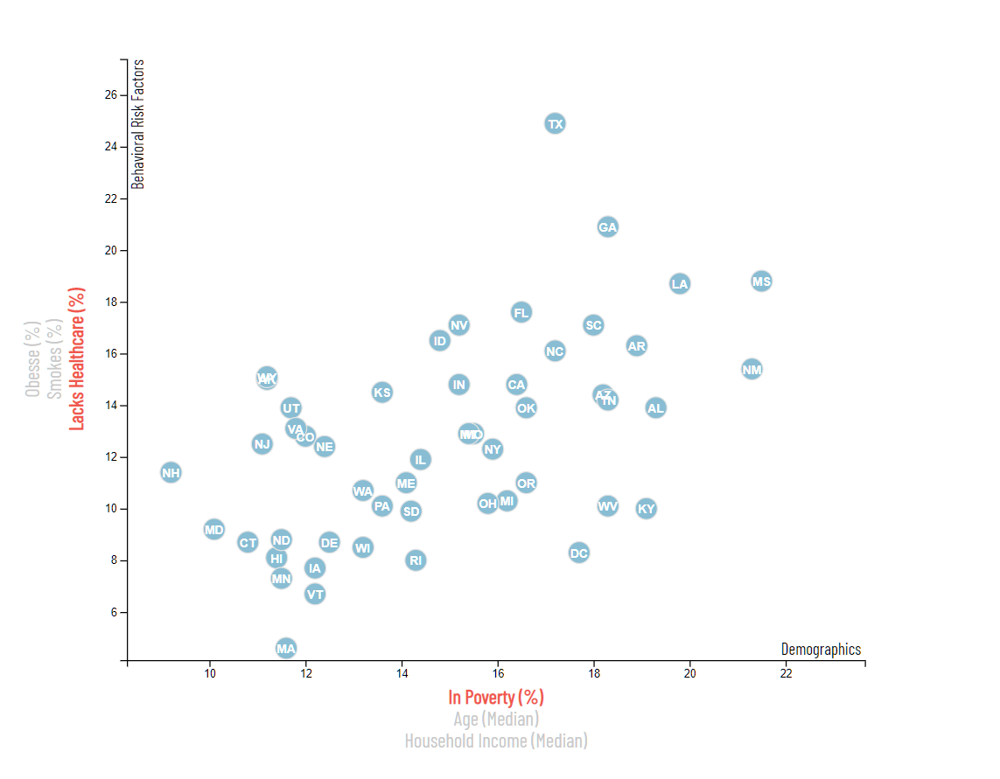

# D3 Data Journalism
In this Data-Driven Document (D3) project, the collected information from the U.S. Census Bureau and the Behavioral Risk Factor Surveillance System has been used to explore the relations between demographics and health risk factors. Each marker represents an individual state in The USA.
This document was created using D3, the JavaScript library for visualizing data with HTML, SVG, and CSS.

Visit this project as a web at the following link: http://farhadomidvar.com/D3-Data-Journalism/

#### Image From the Final App

